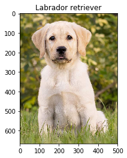
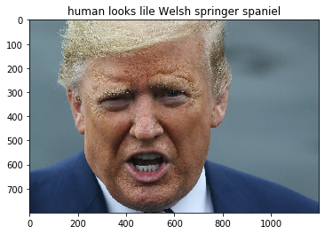
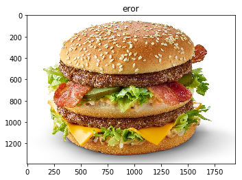

# Dog-Breed-Classifier
Given an image of a dog, the algorithm identifies its breed using convolution neural networks in PyTorch.

The code accepts any user-supplied image as input - it will be resized by `RandomResizedCrop` to 224 by 224 pixels image size. If a dog is detected in the image, it will provide an estimate of the dog's breed. If a human is detected, it will provide an estimate of the dog breed that is most resembling.

* Pretrained `vgg16` is used to detect dogs on photos.
* `OpenCV`'s implementation of `Haar feature-based cascade classifiers` is used to detect human faces in images.
* There are two approaches used to Classify Dog Breeds:
    * Shallow `CNN` with accuracy 31% on 133 labels It consists of four convolution layers combined with the max-pooling layer and the ReLu activation function. The output of the last convolution layer is flattened and combined with a couple of dropout and linear layers.
    * `Transfer Learning` by `ResNet50` with accuracy 81%.

The implementation details can be found in [`Jupyter Notebook`](dog_app.ipynb)

IT stack:
* Python 3.7.6
* PyTorch 1.4.0

Examples:

If a dog is detected - returns its breed

If a human is detected - returns that it is a human and his/her possible breed :)

Neither dog nor human - indicates an error in the photo title

